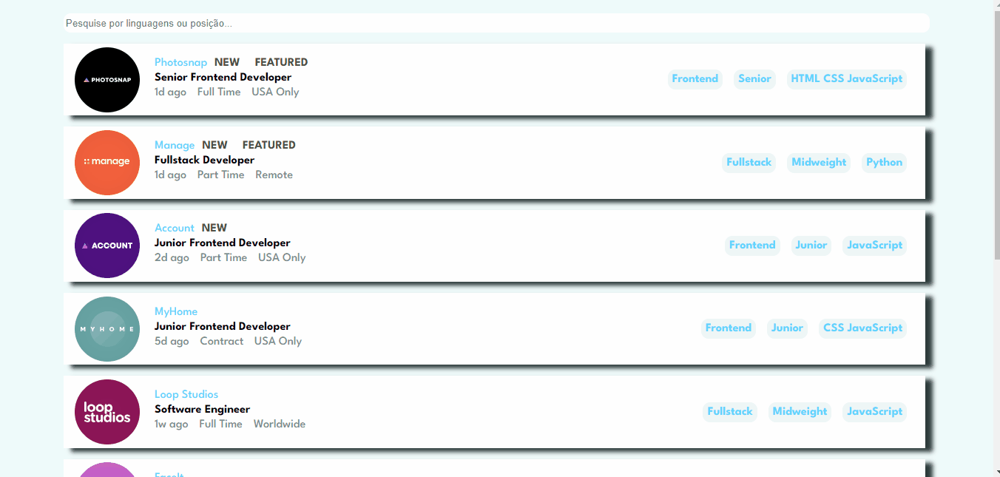

# Job Listings

Esse projeto consiste em uma lista de empregos para área de tecnologia. 0 usuário pode pesquisar pelo tipo de linguagem (javascript) ou pela sua posição (frontend), assim eles não perdem tempo vendo vagas que não o interessam. O projeto está todo responsivo, então pode ser acessado de qualquer dispositivo sem perder sua qualidade.

## Instalação

1. Clone o repositório: git clone https://github.com/tobiasramos/job-listings.git
2. Acesse o diretório do projeto: cd job-listings
3. Instale as dependências: npm install

## Projeto em execução

